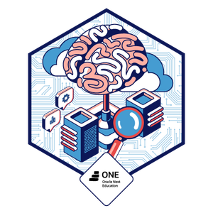
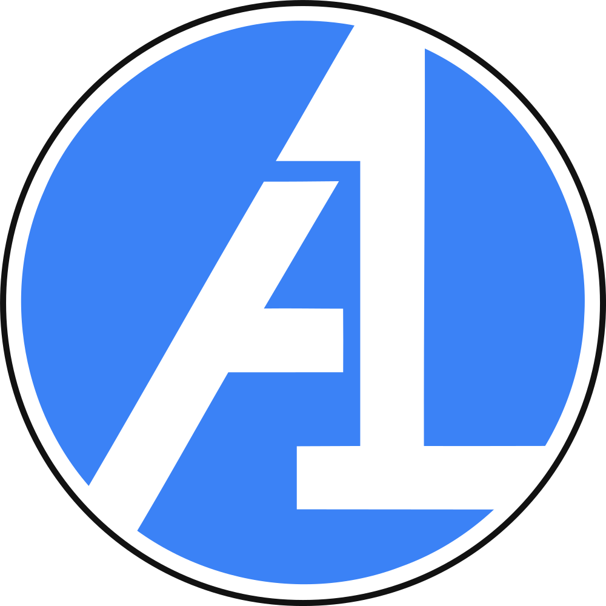

# 🤖 Agente de IA para Consultas de Operaciones y Logística Marítima

<br>

[](https://www.python.org/)
[](https://build.nvidia.com/)
[](https://www.langchain.com/)
[](https://es.wikipedia.org/wiki/Generaci%C3%B3n_aumentada_por_recuperaci%C3%B3n)
[](https://pymupdf.readthedocs.io/)
[](https://github.com/facebookresearch/faiss)
[](https://langchain-ai.github.io/langgraph/)

<br>

Agente diseñado mediante el procesamiento del lenguaje natural para optimizar y resolver consultas sobre las operaciones de carga y logística marítima de la empresa, "_Almacenes y Depósitos Integrales Portuarios, C.A._" (**_DEPORCA_**):

<br>

<div align="center">
    
</div>

<div align="right">
    <p><br>🔗 <a href="https://azocarone-ai-cargo-ops.streamlit.app/">Ver la app en funcionamiento.</a></p>
</div>

<br>

## 📖 Tabla de Contenidos

- 📐 [Planteamiento del Sistema](./docs/planteamiento_del_sistema.md)
- 🛠️ [Desarrollo](#-desarrollo)
- ✔️ [Tecnologías y Técnicas Empleadas](#️-tecnologías-y-técnicas-mpleadas)
- 💻 [Instalación y Configuración](#-instalación-y-configuración)
- ⚙️ [Variables de Entorno](#️-variables-de-entorno)
- 🚀 [Ejecución](#-ejecución)
- 🗺️ [Roadmap](#️-roadmap)
- 📜 [Licencia](#-licencia)

<br>

## 📐 Planteamiento del Sistema (Resumen)

El desarrollo de un **sistema multi-agente** plantea la optimización de las consultas operativas y logísticas de la empresa portuaria **DEPORCA**. La arquitectura se basa en un **Agente Orquestador** que clasifica y redirige las solicitudes hacia tres especialistas: el **Agente Auditor**, el **Agente Financiero** y el **Agente Bot**. Cada uno opera bajo un esquema de **"fuente de verdad"**, utilizando manuales de normas y tarifarios oficiales para garantizar respuestas precisas y sin errores. Este enfoque permite segmentar tareas complejas, como la gestión de **incidentes de seguridad** o el cálculo de **costos de exportación**, asegurando la trazabilidad legal en cada interacción. Al separar las responsabilidades, el sistema mejora la **eficiencia operativa** y reduce significativamente el riesgo de proporcionar información incorrecta al usuario.

<div align="right">
    <p>🔗 <a href="./docs/planteamiento_del_sistema.md">Conoce más sobre la conceptualización del sistema.</a></p>
</div>

<br>

## 🛠️ Desarrollo

1. **Inicialización**: La fase inicial comprende la creación del repositorio en **GitHub**, la asignación de la licencia (**MIT**) para la gestión de los términos de uso del código y la configuración del entorno virtual de **Python**.

2. **Configuración del Motor (LLM)**: Tras la preparación de los datos, se procede a la configuración del modelo de lenguaje. Esto incluye la conexión a la API de **NVIDIA Build**, la gestión y prueba de tokens, la selección del modelo pertinente y la verificación de su correcto funcionamiento.

3. **Preparación de los Datos Base**: Previo a la integración de inteligencia artificial, se requiere el procesamiento de la información. En esta etapa se implementan scripts con **PyMuPDF** para la extracción de texto desde manuales.

4. **Desarrollo de la Lógica (Cadenas base)**: Mediante el uso de **LangChain**, se diseñan los *prompts*, se configura la memoria a corto plazo y se generan los *embeddings* (vectorización de archivos PDF). Asimismo, se implementa la arquitectura **RAG** para habilitar la recuperación de información desde documentos locales, garantizando que el modelo base sus respuestas en los datos provistos.

5. **Implementación del Agente (Flujos con Estado)**: La etapa final integra el sistema RAG construido en el paso anterior con **LangGraph** para establecer un sistema autónomo. Se diseña un flujo de trabajo cíclico que permite al agente evaluar la precisión de las respuestas obtenidas, determinar la necesidad de utilizar herramientas adicionales o ejecutar nuevas iteraciones de búsqueda en la base documental.

<br>

## ✔️ Tecnologías y Técnicas Empleadas

### 1. Entorno de Desarrollo y Control de Versiones

- **Tecnologías:** Git, GitHub, Python (entornos virtuales como `venv`).

- **Técnicas:** Gestión de código fuente, licenciamiento *open-source* (Licencia MIT) y aislamiento de dependencias.

### 2. Infraestructura e Integración de Modelos

- **Tecnologías:** API de NVIDIA Build, Modelos de Lenguaje de Gran Escala (LLM).

- **Técnicas:** Gestión segura de credenciales (API Keys y tokens) y validación de endpoints.

### 3. Ingesta y Procesamiento de Documentos

- **Tecnologías:** `PyMuPDF`.

- **Técnicas:** Extracción y preprocesamiento de texto no estructurado desde archivos PDF (*ETL de datos base*).

### 4. Arquitectura de Contexto e Inteligencia (RAG Base)

- **Tecnologías:** `LangChain`, Vector Stores (bases de datos vectoriales).

- **Técnicas:**

    - **Ingeniería de Prompts:** Diseño de instrucciones base para guiar al modelo.

    - **Embeddings & Vectorización:** Conversión de texto en vectores matemáticos.

    - **RAG (*Retrieval-Augmented Generation*):** Recuperación de contexto Relevante desde documentos locales para mitigar alucinaciones.

### 5. Orquestación y Agentes Autónomos con Estado

- **Tecnologías:** `LangGraph`.

- **Técnicas:**

    - **Flujos con Estado (*Stateful Workflows*):** Control del flujo mediante grafos donde la información y el estado persisten entre nodos.

<br>

## 💻 Instalación y Configuración

Siga estos pasos para configurar el entorno de desarrollo localmente:

1. **Clonar el repositorio:**

    ```bash
    git clone https://github.com/azocarone/ai-cargo-ops
    cd ai-cargo-ops
    ```

2. **Preparar el entorno de desarrollo:**

    - **venv en Linux/Mac:**

        ```bash
        python3.13 -m venv .venv
        source .venv/bin/activate.fish # Shell Fish
        source .venv/bin/activate # Shell Bash
        ```

    - **venv en Windows:**

        ```bash
        python3.13 -m venv .venv
        .\.venv\Scripts\activate
        ````

3. **Instalar dependencias:**
    
    ```bash
    pip install -r requirements.txt
    ```

4. **Crear archivo de variables de entorno:** 

    Cree un archivo `.env` en la raíz del proyecto (ver sección de 🔗[Variables de Entorno](#️-variables-de-entorno)).

<br>

## ⚙️ Variables de Entorno

Para el funcionamiento del sistema, es necesario configurar las siguientes variables en el archivo `.env`:

| Variable          | Descripción                                                             | Requerido | Ejemplo   |
| :-----------------| :---------------------------------------------------------------------- | :-------- | :---------|
| `LOG_LEVEL`       | Nivel de verbosidad del log (DEBUG, INFO, WARNING, ERROR, CRITICAL)     | Sí        | WARNING   |
| `ASSETS_PATH`     | Directorio de alojamiento de los documentos PDF para el RAG             | Sí        | ./assets  |
| `MODO_DESARROLLO` | Define perfil de operación del LLM (Desarrollo=True y Producción=False) | Sí        | True      |
| `NVIDIA_API_KEY`  | NVIDIA Build API KEY                                                    | Sí        | "API KEY" |

<br>

## 🚀 Ejecución

Estando en el directorio raíz del proyecto, acceder al sub-directorio `src`:

```bàsh
cd src
```

Luego podrá ejecutar las respectivas interfaces del sistemas:

- **Interfaz CLI:**

    ```bàsh
    python app.py
    ```

- **Interfaz Web:**

    ```bàsh
    streamlit run app_web.py  
    ```

> También, puede 🔗 <a href="https://azocarone-ai-cargo-ops.streamlit.app/">ver la versión Web en funcionamiento</a> en **Streamlit Community Cloud**.

<br>

## Sección Base de Test al Sistema

| Preguntas | Agentes |
|:---------|:-------:|
| ¿Qué pasa si un contenedor esta dañado? | Auditor | 
| ¿Qué debe hacer el Agente de Aduanas si el funcionario del SENIAT tiene un criterio técnico con el que la empresa no está de acuerdo? | Auditor | 
| Hola, necesito hacer un embarque de 3 contenedores en el mismo booking. ¿Cuánto me costaría el agenciamiento aduanal? | Financiero | 
| Hola, requiero exportar 3 contenedores en un mismo booking desde Valencia hacia el puerto. Además, uno de ellos tiene una factura con 5 ítems de clasificación arancelaria compleja. ¿Cuánto me costaría el agenciamiento, la DUA y el transporte? ¿Puedo pagar en bolívares? | Financiero |
| ¿Cuál es el costo del agenciamiento aduanal para el primer contenedor de un embarque? | Financiero |
| Hola, cuanto sale un flete. | Financiero |
| ¿Cuánto me sale el flete para mañana? Y otra cosa, ¿cómo hago con la inspección del precinto? | Financiero, Auditor |
| ¿Qué documentos integran el 'Expediente Especial de Trazabilidad de Planta' en caso de una alerta antidrogas? | Auditor |
| ¿Bajo qué jurisdicción aduanera opera exclusivamente DEPORCA? | Bot |
| Hola, buenas tardes, necesito ayuda por favor. | Bot |
| Hola | Bot |

<br>
                                                                                            
## 🗺️ Roadmap

- [ ] Manejo del historial conversacional a corto plazo (Gestión de Memoria).
- [ ] Gestión de colas de usuarios.
- [ ] Mejora de las interfaces de usuario (UI).
- [ ] API REST (FastAPI).

<br>

## 📜 Licencia

Este proyecto se distribuye bajo la **Licencia MIT**. El contenido personal y la trayectoria profesional son propiedad intelectual de **José Azócar**.

<br>

---

<br>

<p align="center">
  
  
  <div align="right">
    <strong>José Antonio Azócar Marcano</strong><br>
    Ing. Informático | Consultor I&O: Infraestructura y Ops.<br>
    ⬆ <a href="#-agente-de-ia-para-consultas-de-operaciones-y-logística-marítima">Up</a>
  </div>
  <br clear="all">
</p>