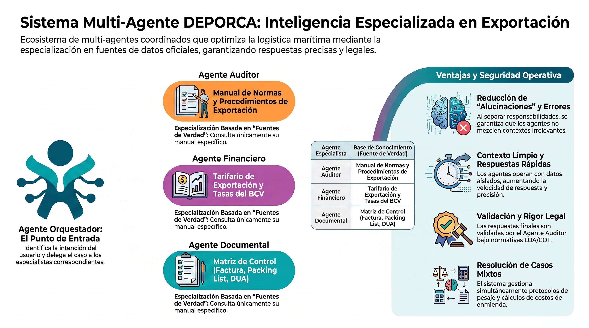
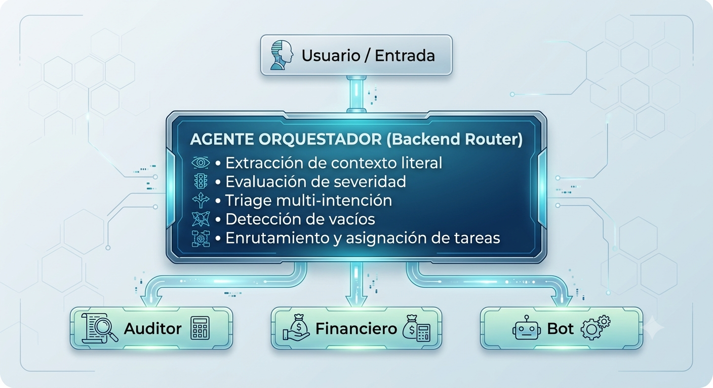
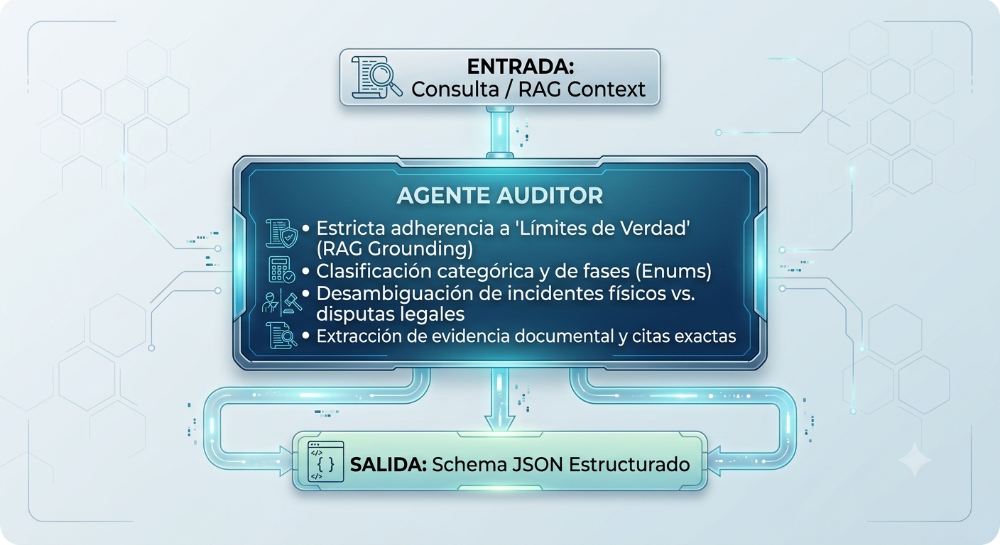
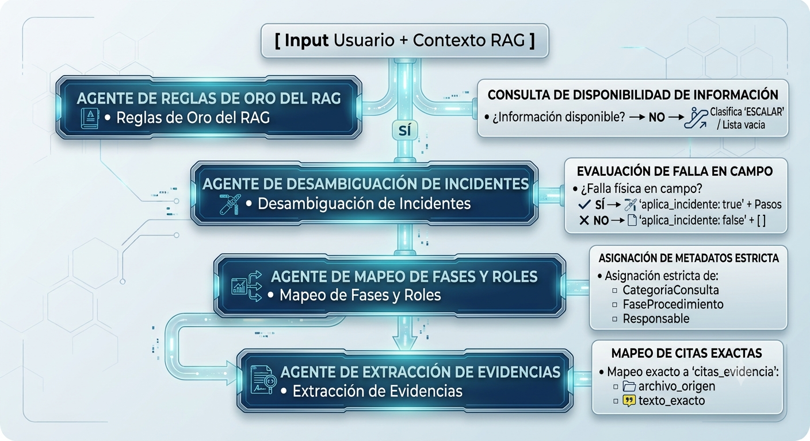
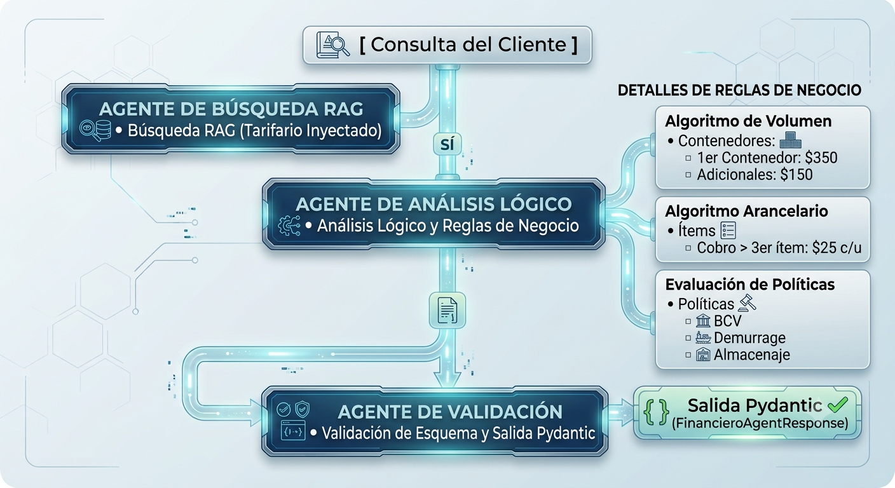
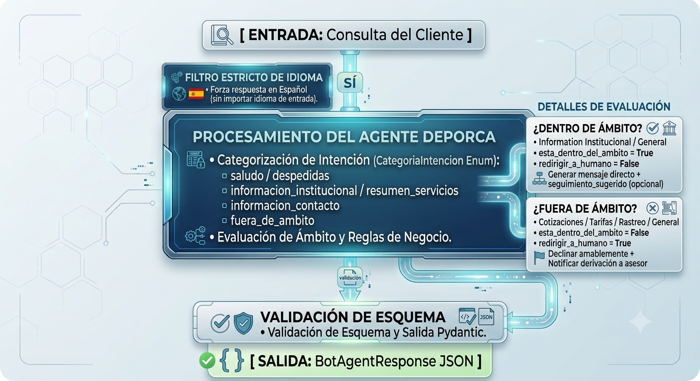

# Planteamiento del Sistema

<div align="center">
  
</div>

---

El enfoque radica en el desarrollo de un sistema de **multi-agentes**, ya que permitirá una especialización profunda basada en la documentación de **DEPORCA**:

- [Manual de Normas y Procedimientos de Exportación](../assets/manual_normas_procedimientos_exportacion.pdf)
- [Tarifario de Exportación](../assets/tarifario_exportacion.pdf)
- [Sección Base de Preguntas y Respuestas](../docs/seccion_base_preguntas_respuestas.pdf)

---

En un ecosistema multi-agente para las "Consultas de Operaciones y Logística Marítima de **DEPORCA**", la estructura funcionará bajo una jerarquía coordinada:

## 1. Agente Orquestador (Backend Router)

### Contexto

El **Agente Orquestador** actúa como el punto de entrada principal (*Backend Router*) y capa de triage determinista del sistema multi-agente. Su propósito fundamental **no es interactuar ni responder al usuario final**, sino analizar la entrada del usuario (*prompt injection/input*), extraer metadatos operativos y preparar una carga útil (*payload*) estructurada para su posterior enrutamiento a los subagentes especializados.

<div align="center">
  
</div>

#### Principios de Operación Backend:

* **Cero interacción directa:** Tiene prohibido emitir respuestas conversacionales o entablar diálogo con el usuario.
* **Procesamiento determinista:** Funciona bajo un esquema estricto de clasificación y extracción de datos sin asumirlos ni inferir intenciones implícitas.
* **Routing multi-intención:** Soporta la activación simultánea de uno o más subagentes si la consulta del usuario abarca diferentes áreas operativas en un solo mensaje.

---

### Mecanismos de Operación

El orquestador procesa la entrada mediante cuatro mecanismos clave de análisis y extracción:

#### A. Clasificación de Intenciones y Ruteo (`agentes_activados`)

Mapea los requerimientos explicitados en la entrada hacia tres dominios operativos específicos:

- **`auditor`:** Asuntos de cumplimiento operativo, seguridad física, inspecciones, inconsistencias con autoridades (ej. SENIAT), contingencias legales o precintos.
- **`financiero`:** Consultas de costos, fletes, agenciamiento aduanal/DUA, cotizaciones, tasas de cambio (BCV), facturación y cobros.
- **`bot`:** Manejo de interacciones de cortesía (saludos/despedidas) y consultas fácticas, históricas o institucionales de DEPORCA.

#### B. Segmentación Sintáctica y Extracción (`contexto_agente`)

- Aísla y asigna a cada subagente activado la **oración o cláusula literal exacta** que motiva su intervención.
- Garantiza que el subagente reciba únicamente el contexto del usuario relevante para su tarea, preservando cantidades, modificadores y estatus originales sin parafrasear.

#### C. Evaluación de Severidad y Priorización (`prioridad`)

Aplica la regla operacional de **"peor escenario"** (*worst-case scenario*) para asignar el nivel de prioridad global a la solicitud:

- **`alta`:** Bloqueos operativos inminentes, incidentes de seguridad, precintos violentados o riesgos legales.
- **`mediana`:** Operaciones en curso, estatus de carga activa y trámites diarios.
- **`baja`:** Cotizaciones, consultas informativas generales o saludos.

#### D. Detección de Faltantes Específicos (`datos_faltantes`)

- Identifica la ausencia de variables/identificadores clave (ej. `"codigo_booking"`, `"numero_contenedor"`, `"bl_code"`) cuando la acción solicitada requiere auditar, rastrear o liberar un activo individual.
- Evita falsos positivos al no exigir identificadores cuando la consulta es puramente estimativa o de carácter general.

---

### Ejemplo de Estructura de Datos JSON

A partir de un esquema Pydantic (`OrquestadorAgentResponse`), la salida producida por el modelo para una consulta compleja multi-intención sería:

> *"¿Cuánto me sale el flete para mañana del contenedor BKG-9921? Y otra cosa, ¿cómo hago porque el precinto vino roto?"*

Genera la siguiente estructura JSON validada:

```json
{
  "agentes_activados": [
    {
      "agente": "financiero",
      "contexto_agente": "¿Cuánto me sale el flete para mañana del contenedor BKG-9921?"
    },
    {
      "agente": "auditor",
      "contexto_agente": "Y otra cosa, ¿cómo hago porque el precinto vino roto?"
    }
  ],
  "prioridad": "alta",
  "datos_faltantes": []
}
```

> **Nota de implementación:** En este escenario, a pesar de que la consulta financiera es de prioridad `mediana`, la presencia del evento de seguridad (`precinto vino roto`) eleva la `prioridad` global del *payload* a **`alta`**, permitiendo que los sistemas de colas downstream procesen la solicitud con el nivel de urgencia adecuado.

---

## 2. Colaboración de Especialistas (Subagentes)

Para conformar un sistema multi-agente robusto para **DEPORCA**, se deben definir roles especializados que utilicen las fuentes documentales como su única base de conocimiento. Al separar las responsabilidades, se garantiza que cada agente use solo la "**fuente de verdad**" necesaria, reduciendo los tokens y alucinaciones. A continuación se detalla la configuración para cada agente, integrando el **Manual de Normas**, y el **Tarifario**.

---

### 2.1.Agente Auditor (Basado en el Manual)

#### Contexto

El **Agente Auditor** es un componente de Inteligencia Artificial especializado en la auditoría, verificación y soporte operativo dentro de la cadena de logística portuaria y aduanera de la empresa *Almacenes y Depósitos Integrales Portuarios, C.A. (DEPORCA)*, operando bajo la jurisdicción de la Aduana Principal de Puerto Cabello (Bolipuertos), Estado Carabobo, Venezuela.

<div align="center">
  
</div>

##### Propósito Integrador

El agente actúa como un **mecanismo de control de calidad de la información** para consultas de comercio exterior. Evalúa solicitudes sobre procedimientos de exportación, responsabilidades operativas y protocolos ante contingencias, garantizando que cada afirmación esté fundamentada exclusivamente en la base de conocimientos (*RAG Context Grounding*) y previniendo alucinaciones en un entorno de alto riesgo regulatorio.

---

#### Mecanismos de Operación

El flujo de procesamiento del agente integra validaciones semánticas en el *System Prompt* y restringe sintácticamente la salida mediante *Pydantic*:

<div align="center">
  
</div>

##### A. Garantía de Cero Alucinación (Límites de Verdad RAG)

- **Principio de Cierre de Dominio:** El agente opera bajo la premisa de *Mundo Cerrado*. Si un dato (tarifas, leyes, roles) no está explícitamente en el contexto recuperado, el agente aplica de forma obligatoria el flujo de degradación controlada:
- `categoria_consulta` = `"No Detectado / Escalar"`
- `fase_procedimiento` = `"No Aplica"`
- `respuesta_directa` = Instrucción explícita de escalar a la *Gerencia General* o al *Departamento de Operaciones Especiales*.

##### B. Criterio de Desambiguación de Emergencias y Contingencias

- **Fallas Físicas vs. Disputas Administrativas:** El sub-objeto `protocolo_emergencia` activa el flag `aplica_incidente: true` **únicamente** ante eventos de seguridad u operatividad física en campo (ej. alertas de la GNB/canes antidrogas, rotura de precintos, discrepancias en romana).
- **Lógica de Control Numérico/Estructura:** Si no existe un incidente físico (ej. discrepancia arancelaria con el SENIAT), la regla de negocio exige forzar `acciones_inmediatas: []` y `documentos_requeridos: []`.

##### C. Asignación de Roles y Fases Operativas

- **Extracción de Roles:** Escanea cargos específicos (ej. *"Agente de Aduanas"*, *"Supervisor de Almacén"*). Asigna `"No especificado en manual"` solo ante la ausencia absoluta de menciones.
- **Mapeo a Enums:** La salida está limitada por enumeraciones de Python (`Enum`), garantizando consistencia en integraciones downstream:
- `CategoriaConsulta` (Pre-Embarque, Operación Aduanera, Post-Embarque, Control Interno, Protocolos de Emergencia, Escalar).
- `FaseProcedimiento` (Fases A, B, C, Normas Generales, No Aplica).

##### D. Trazabilidad de Evidencias (Citas Auditoras)

- Cada respuesta requiere poblar de forma obligatoria el campo `citas_evidencia` con el objeto `CitaBaseConocimiento`, extrayendo la tupla `(archivo_origen, texto_exacto)` para auditar la veracidad del dictamen dictado por el modelo.

---

#### Ejemplo de Estructura de Datos JSON

El siguiente esquema representa la serialización JSON del objeto `AuditorAgentResponse` tras procesar una consulta sobre un **incidente físico de seguridad en puerto**:

```json
{
  "categoria_consulta": "Protocolo de Incidentes y Emergencias",
  "respuesta_directa": "Ante una alerta por marcaje positivo de can detector de la GNB en la inspección de seguridad, se debe proceder a la retención inmediata de la unidad y su traslado a la fosa de revisión profunda. El Agente de Aduanas y el representante legal deben exigir estar presentes de manera ininterrumpida en el Acto de Vaciado de Emergencia (Unstuffing) y consignar el Expediente Especial de Trazabilidad de Planta.",
  "responsable_operativo": "Agente de Aduanas y Representante Legal",
  "fase_procedimiento": "Fase de Operación Aduanera (Procedimiento B)",
  "sustento_legal_o_normativo": [
    "Caso 6.2: Alertas en Inspección de Seguridad",
    "Ley Orgánica de Drogas"
  ],
  "protocolo_emergencia": {
    "aplica_incidente": true,
    "acciones_inmediatas": [
      "Exigir estar presente de forma física e ininterrumpida en el Acto de Vaciado de Emergencia (Unstuffing).",
      "Consignar de inmediato el Expediente Especial de Trazabilidad de Planta ante el comando de la GNB."
    ],
    "documentos_requeridos": [
      "Copia del registro de la ruta satelital (GPS) del transporte desde la planta.",
      "Reporte fotográfico con marca de agua (fecha y hora) del cierre de compuertas.",
      "Bitácora de firmas del personal de seguridad interna que custodió el llenado."
    ]
  },
  "citas_evidencia": [
    {
      "archivo_origen": "manual_normas_procedimientos_exportacion.pdf",
      "texto_exacto": "El Agente de Aduanas y el representante legal de DEPORCA deben exigir estar presentes de manera física e ininterrumpida en el Acto de Vaciado de Emergencia..."
    }
  ]
}
```

---

### 2.2. Agente Financiero (Basado en el Tarifario)

#### Contexto

El Agente Financiero opera como un asistente virtual especializado en **atención al cliente y cotización automatizada** de servicios logísticos, aduaneros y portuarios. Su ámbito de dominio comprende la liquidación de tarifas de exportación, la explicación de políticas comerciales y el desglose de costes operativos.

<div align="center">
  
</div>

---

#### Mecanismos de Operación

El flujo de procesamiento del agente sigue una secuencia lógica determinista apoyada por el LLM (*Large Language Model*), garantizando trazabilidad y salidas estructuradas mediante Pydantic.

<div align="center">
  
</div>

##### Reglas de Negocio Integradas

1. **Lógica de Descuento por Volumen en Booking:**
    - Contenedor $1$: Tarifa base ($350.00 USD).
    - Contenedores $N+1$: Tarifa marginal ($150.00 USD por equipo adicional).

2. **Cálculo de Clasificación Arancelaria Compleja:**
    - Ítems $1$ al $2$: Incluidos en la tarifa base ($0.00 USD).
    - Ítems $\ge 3$: $25.00 USD por ítem adicional (Ej: $5\text{ ítems} \rightarrow (5 - 2) \times 25 = \$75.00\text{ USD}$).

3. **Manejo Multimoneda y Conversión Legal:**
    - Moneda base de cálculo: USD.
    - Pagos en moneda nacional (VES): Referenciados a la tasa oficial del Banco Central de Venezuela (BCV) vigente a la fecha de pago o facturación.

4. **Respuesta Bicanal (Humano - Máquina):**
    - **Para el cliente (`respuesta_cliente`):** Redacción en primera persona del plural ("En DEPORCA..."), en formato Markdown (*scannable* con negritas y viñetas).
    - **Para auditoría/sistemas (`analisis_consulta`, `desglose_costos`):** Desglose explícito y sumatoria matemática estricta.

---

#### Ejemplo de Estructura de Datos JSON

A continuación, se presenta la representación JSON resultante de la validación del esquema Pydantic (`FinancieroAgentResponse`), correspondiente al escenario de procesamiento de una consulta compleja de exportación:

```json
{
  "analisis_consulta": "Se calculan 3 agenciamientos aduanales (1er equipo base de $350.00 + 2 adicionales a $150.00 c/u), transporte terrestre desde Valencia para 3 contenedores ($380.00 c/u), recargo por 3 ítems adicionales de clasificación arancelaria compleja aplicables a partir del 3er ítem ($25.00 c/u) y la emisión del expediente DUA ($30.00).",
  "respuesta_cliente": "En DEPORCA, con gusto le presentamos la estimación para su embarque de 3 contenedores desde Valencia:\n\n- **Agenciamiento Aduanal:** $350.00 USD (1er contenedor) + $300.00 USD (2 adicionales) = $650.00 USD\n- **Flete Terrestre (Valencia - Puerto Cabello):** $380.00 USD x 3 = $1,140.00 USD\n- **Clasificación Arancelaria Compleja:** 3 ítems excedentes x $25.00 USD = $75.00 USD\n- **Emisión e Impresión de DUA/Pases:** $30.00 USD\n\n**Monto Total Estimado:** $1,895.00 USD\n\n*Condición de Pago:* Puede cancelar en Bolívares calculados a la tasa de cambio oficial del Banco Central de Venezuela (BCV) vigente a la fecha de pago.",
  "desglose_costos": [
    {
      "concepto": "Agenciamiento de Aduana Base",
      "tarifa_base_usd": 350.0,
      "unidad_cobro": "Por Contenedor (1er Equipo)",
      "observaciones": "Incluye transmisión SIDUNEA y confrontación."
    },
    {
      "concepto": "Contenedor Adicional (Mismo Booking)",
      "tarifa_base_usd": 300.0,
      "unidad_cobro": "Por Equipo adicional (2 unidades x $150.00)",
      "observaciones": "Aplicable por amparar la misma DUA/Factura."
    },
    {
      "concepto": "Flete Local (Valencia - Puerto Cabello)",
      "tarifa_base_usd": 1140.0,
      "unidad_cobro": "Por Viaje (3 contenedores x $380.00)",
      "observaciones": "Incluye transporte de vacío y lleno."
    },
    {
      "concepto": "Clasificación Arancelaria Compleja",
      "tarifa_base_usd": 75.0,
      "unidad_cobro": "Por ítem adicional (3 ítems x $25.00)",
      "observaciones": "Cobro aplicable a partir del 3er ítem en factura."
    },
    {
      "concepto": "Emisión e Impresión de DUA / Pases",
      "tarifa_base_usd": 30.0,
      "unidad_cobro": "Por Expediente",
      "observaciones": "Gastos administrativos y papelería técnica."
    }
  ],
  "politica_aplicable": "Las tarifas están fijadas en USD. Los pagos realizados en Bolívares se calcularán estrictamente a la tasa de cambio oficial publicada por el Banco Central de Venezuela (BCV) vigente para la fecha de facturación o pago efectivo.",
  "monto_total_estimado_usd": 1895.0
}
```

---

### 2.3. Agente Bot (Asistente Virtual)

#### Contexto

El **Asistente Virtual de Almacenes y Depósitos Integrales Portuarios, C.A. (DEPORCA)** está concebido como un agente de IA conversacional de primer nivel (Nivel 1 de atención), orientado al ámbito **institucional e informativo**.

Su propósito fundamental es actuar como un filtro de interacción eficiente: resuelve dudas fácticas de cara al cliente (historia, misión, servicios generales, ubicación y contacto) y aplica **reglas estrictas de contención y enrutamiento** cuando la solicitud escala a temas operativos, comerciales (cotizaciones, rastreo) o ajenos a la organización.

<div align="center">
  
</div>

---

#### Mecanismos de Operación

El agente opera mediante un flujo de procesamiento estructurado (*Structured Outputs*) respaldado por validación de esquemas en Python (*Pydantic*):

<div align="center">
  
</div>

- **Evaluación de Ámbito e Intención:** Clasifica la entrada del usuario en una categoría delimitada mediante la enumeración `CategoriaIntencion` (`saludo`, `despedida`, `informacion_institucional`, `resumen_servicios`, `informacion_contacto` o `fuera_de_ambito`).

- **Regla Estricta de Idioma:** Analiza el texto de entrada y fuerza la generación de la respuesta (`mensaje`) **únicamente en idioma español**, sin importar el idioma de origen del usuario.

- **Mecanismo de Desviación y Escalado (Handoff):** Si se detecta un tema fuera de alcance (p. ej., cotizaciones o estatus de contenedores), se asigna el atributo `esta_dentro_del_ambito = False` y se activa la bandera booleana `redirigir_a_humano = True` para delegar el caso a un asesor comercial.

- **Guiado Conversacional (Proactividad):** Puede incorporar de forma opcional una pregunta o sugerencia contextual mediante `seguimiento_sugerido` para orientar al usuario dentro del flujo permitido.

---

#### Ejemplo de Estructura de Datos JSON

A continuación se muestra la salida esperada del modelo tras procesar la consulta de un cliente extranjero que solicita cotizaciones:

**Entrada del usuario:**

> *"Hi, I need a quote for shipping a 40ft container to Puerto Cabello."*

**Salida estructurada JSON (Validada por `BotAgentResponse`):**

```json
{
  "esta_dentro_del_ambito": false,
  "categoria": "fuera_de_ambito",
  "mensaje": "Hola. Atendemos únicamente en idioma español. Lamentablemente no realizamos cotizaciones directamente por este medio. Para consultar tarifas y detalles operativos, te transferiremos con un asesor comercial.",
  "redirigir_a_humano": true,
  "seguimiento_sugerido": null
}
```
---

## Ventajas del Enfoque Multi-Agente para DEPORCA

1. **Contexto Limpio:** El Agente Financiero no necesita "leer" el protocolo de incidentes antidrogas para cotizar un flete, lo que hace sus respuestas más rápidas y precisas.

2. **Seguridad Operativa:** Como indica el manual, "cualquier manifestación verbal carece de validez legal". Un sistema multi-agente permite que la respuesta final sea validada por el **Agente Auditor** antes de mostrarse al usuario, asegurando que se cite siempre la base legal correcta (LOA, COT o LOD).

3. **Flujos de Trabajo Complejos:** Permite resolver situaciones mixtas. Por ejemplo, ante una "Discrepancia de Peso" (Caso 6.1), el **Agente Auditor** dicta el protocolo de re-pesaje, mientras el **Agente Financiero** calcula automáticamente el costo de la "Enmienda de DUA" ($100 USD) según el tarifario.